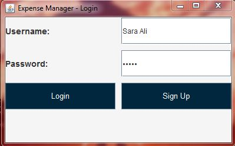
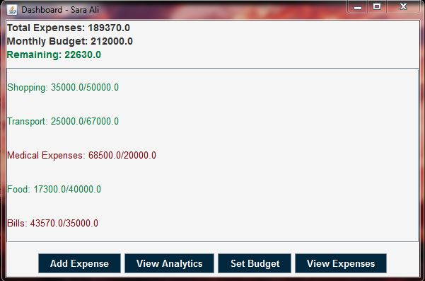
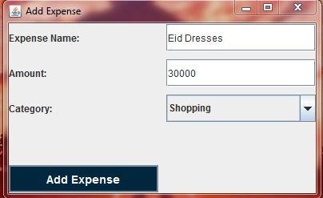
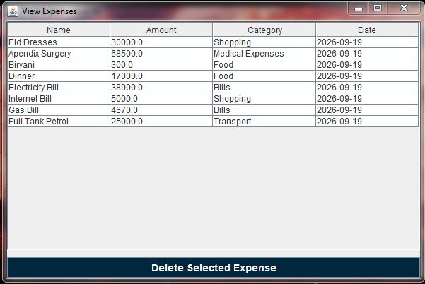
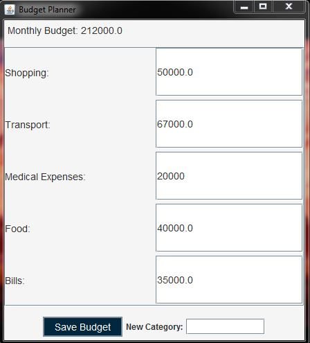
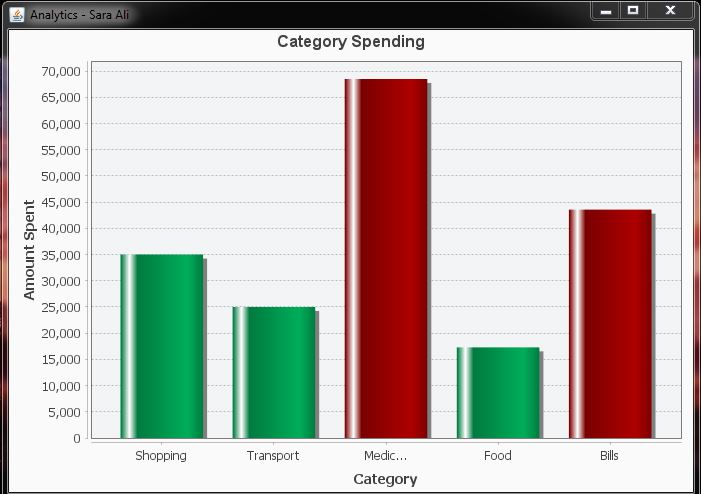

# Expense Manager

A Java Swing-based desktop application for managing personal expenses, setting budgets, and analyzing spending through graphical visualizations.

This project was developed as a student project to practice Java, Object-Oriented Programming, MVC architecture, file handling, GUI development, and data visualization.

## Features

- User registration and login
- Add and manage expenses
- Categorize expenses
- View expense history
- Monthly budget planning
- Category-based budget limits
- Spending analytics
- Graphical expense visualization using JFreeChart
- Local file-based data persistence
- Separate expense and budget data for each user

## Screenshots

### Login Screen

<p align="center">
  
</p>

### Dashboard

<p align="center">
  
</p>

### Add Expense

<p align="center">
  
</p>

### View Expenses

<p align="center">
  
</p>

### Budget Planner

<p align="center">
  
</p>

### Analytics

<p align="center">
  
</p>

## Technologies Used

- **Java**
- **Java Swing** – Graphical User Interface
- **JFreeChart** – Data visualization
- **Object-Oriented Programming (OOP)**
- **MVC Architecture**
- **File Handling**
- **Java Collections**
- **Local File-Based Data Storage**

## Project Structure

```text
ExpenseManager/
│
├── src/
│   ├── controller/
│   │   ├── ExpenseManager.java
│   │   ├── ExpenseOperations.java
│   │   └── FileHandler.java
│   │
│   ├── gui/
│   │   ├── AddExpenseScreen.java
│   │   ├── AnalyticsScreen.java
│   │   ├── BudgetPlannerScreen.java
│   │   ├── Dashboard.java
│   │   ├── LoginScreen.java
│   │   └── ViewExpenseScreen.java
│   │
│   └── model/
│       ├── Budget.java
│       ├── Expense.java
│       └── User.java
│
├── lib/
│   └── jfreechart-1.5.3.jar
│
├── screenshots/
│   ├── AddExpense.JPG
│   ├── Analytics.JPG
│   ├── BudgetPlanner.JPG
│   ├── Dashboard.JPG
│   ├── LoginScreen.JPG
│   └── ViewExpenses.JPG
│
├── .gitignore
└── README.md
```

## Architecture

The project follows the **Model-View-Controller (MVC)** architecture.

### Model

The model layer represents the application's core data:

- `User`
- `Expense`
- `Budget`

### View

The GUI layer provides the user interface using Java Swing:

- Login Screen
- Dashboard
- Add Expense Screen
- View Expenses Screen
- Budget Planner
- Analytics Screen

### Controller

The controller layer handles application logic and file operations:

- `ExpenseManager`
- `ExpenseOperations`
- `FileHandler`

## Data Storage

The application uses local text files for data persistence.

The application stores:

- User account information
- User expenses
- Monthly budgets
- Category-based budget limits

User-specific files are generated at runtime based on the username.

For example:

```text
users.txt
username_expenses.txt
username_budget.txt
```

Runtime-generated user data is excluded from this repository using `.gitignore`.

## JFreeChart

The project uses **JFreeChart 1.5.3** to generate graphical representations of expense data and provide spending analytics.

The required JFreeChart library is included in the `lib` directory.

## Learning Outcomes

Through this project, I practiced:

- Object-Oriented Programming in Java
- Designing desktop GUI applications using Java Swing
- Applying MVC architecture
- Working with multiple Java classes and packages
- File handling and data persistence
- Using Java collections
- Creating graphical data visualizations with JFreeChart
- Organizing a multi-class Java application
- Separating application logic, data models, and user interface components

## Project Highlights

This project helped me move beyond individual Java programs and work with a larger application consisting of multiple classes and interconnected components.

Some of the main concepts applied include:

- **Encapsulation** through model classes
- **Separation of concerns** through MVC
- **File I/O** for persistent storage
- **GUI event handling** using Java Swing
- **Data visualization** using JFreeChart
- **Object-oriented design** across multiple components

## Future Improvements

Possible improvements for a future version include:

- Database integration instead of text-file storage
- Password hashing and improved authentication security
- Improved input validation
- Exporting expense reports
- Additional analytics and charts
- Search and filtering functionality
- More flexible date-based expense analysis
- Improved UI design and responsiveness

## Disclaimer

This project was developed as a student project for educational purposes.

It is a demonstration of software development concepts and is **not intended to provide financial advice or serve as a production financial management system**.

## Author

**Gul I Hina**

Bachelor of Science in Software Engineering  
COMSATS University Islamabad
